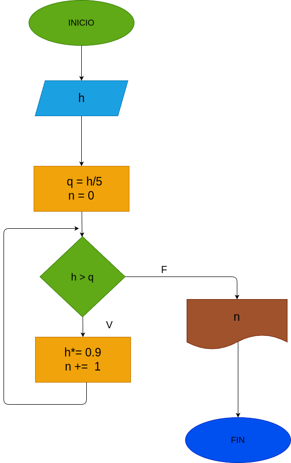

# While_2
Una pelota se deja caer de una altura (h), y en cada rebote sube el
10% menos del anterior. Hacer el diagrama de flujo y el programa en
Python, que lea (h), y que calcule e imprima en cual rebote la pelota
no alcanza a subir la 5 parte de la altura inicial.

# Analisis

## Input

### Variables de entrada
h: ingrese la altura a la cual se somete la pelota
### prosesisng
q = h / 5

n = 0

mientras h > q:

h * 0.9

n + 1

### output
n
# Diseño

 
# Construcción